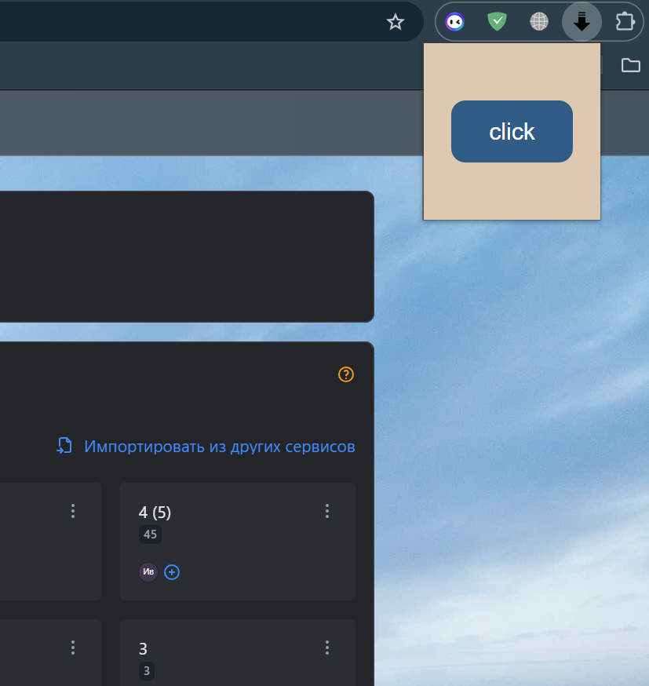
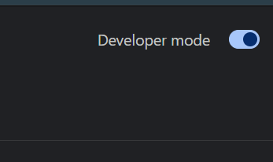
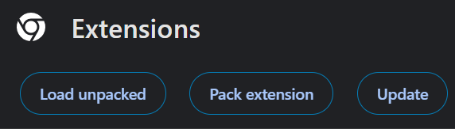

# Расширение для сайта yougile.com

## **Описание**

На сайте yougile.com раскрывает весь список проектов, с помощью клавиши PageUp или нажатием кнопки в выпадающем окне меню расширений.

С помощью кнопки

.mp4)

Или тоже самое по кнопке PageUp

## **Установка**

Для начала скачайте архив с расширением. Для google chrome перейдите в расширения и включите режим Developer mode в правом верхнем углу

Далее загрузите файл в Load unpacked

Выберите загруженный файл и нажмите выбор папки

После этого в расширениях у вас появится новое расширение - теперь расширение готово к использованию
